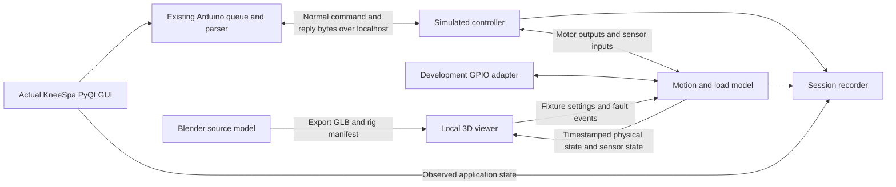

# Blender model and desktop testing mode

Prepared September 21, 2026. Status: implementation plan; no simulator integration or
Blender editing has been performed for this plan.

Build a development mode that opens the actual KneeSpa PyQt application and a local
3D viewer together. The operator uses the real application to configure, start,
adjust, and stop treatments while watching a simulated device respond. Blender is
the model authoring tool; everyday testing uses the lightweight browser viewer.
The user selected this arrangement during planning.

## 1. What the supplied project contributes

Source: `C:/Users/patri/Downloads/drx-simulator-main.zip`.
Archive SHA-256:
`A10954FE827D51354BFC6AC545759DC01F48FF0E3D98B09C85FE82D593BF04FB`.

A reference copy was extracted to the ignored directory
`development/reference/local/drx-simulator-plan-2026-09-21/drx-simulator-main/`.
The archive's README and session handoff were read as historical project material,
not as instructions to execute commands, deploy, or change the current application.

Verified by reading source and the GLB JSON structure:

| Existing asset | Use in the new testing mode |
| --- | --- |
| `web/public/models/drx.glb` | Starting geometry for the Blender source model. It is 2,061,428 bytes, with 126 nodes, 111 meshes, 10 materials, and no embedded animations. |
| Named `static_frame`, `horizontal_pivot`, `lateral_pivot`, `axial_slider` nodes | Preserve these stable rig identifiers and verify their geometry and coordinate frames. |
| `drxAxisLocal` and other GLB extras | Useful starting metadata; audit and regenerate where model axes are corrected. |
| React Three Fiber scene, orbit controls, camera presets | Reuse for the local viewer. Existing presets are side, overhead, and three-quarter views. |
| Model and motion inspection/capture scripts | Adapt into repeatable export and pose checks; do not assume previous reported results apply to this checkout. |
| Browser simulation and protocol runner | Reference material for visual behavior; exclude them from control of the integrated test session. |

The ZIP contains neither a `.blend` source nor the original STEP/Inventor assembly.
The existing GLB is sufficient to begin. Original CAD, dimensions, and motion
references would improve mechanical fidelity later.

Important differences found in the supplied code:

- Its browser parser treats `K <value>` as degrees and `B<value>` as horizontal
  angle. The current Python application sends calibrated raw position commands,
  including `K<counts>` and `I13<counts>`.
- The current application also uses typed completion, firmware identity, explicit
  tare, motor-speed configuration, parameterized pulse, and pressure commands such
  as `P<target>|<selected>`. A generic immediate success reply is insufficient.
- Browser `pressureToAxialTarget()` linearly maps 0–80 lb to 0–4 inches. That is an
  illustrative mapping, not a measured load model.
- `DeviceModel.tsx` adds pulse displacement using browser time at 1.5 Hz and
  0.25-inch amplitude. Integrated testing must render the backend's motion.
- `ProtocolRunner.ts` is a separate simplified implementation; its protocol 4
  angle selection returns zero and does not implement the current Python runner's
  repeated left/right treatment sequence.
- The viewer corrects axial alignment, hides parts, and generates a gap cover at
  runtime. These adjustments must be reviewed during Blender cleanup.
- The browser's latched stop with pressure decay does not match every current
  firmware stop path. Serial `X`, GUI treatment stop, physical stop, and sensor
  faults need separate scenarios.

No browser build, simulator tests, or Blender render was run during this inspection.

## 2. The intended operator experience

Proposed command, to be implemented:

```powershell
python development/tools/run_simulator.py
```

A Windows shortcut can invoke the same launcher after installation of dependencies.

1. Start the local simulation service and verify its readiness and model version.
2. Open the real KneeSpa GUI with a dedicated simulation profile.
3. Open the viewer with the device, camera controls, live measurements, and a
   collapsible test-controls panel.
4. Let the normal connection, reset, firmware checks, calibration, and baseline
   sequence complete through the simulated device.
5. Operate Setup and Treatment exactly through the actual application. Changes
   travel through the real command queue and parser; the model follows simulated
   physical position, and the GUI receives simulated sensor feedback.
6. Inject a fault or press a simulated physical control from the viewer. Observe
   the device response, GUI messages, and recovery requirements together.
7. End the session and retain its commands, telemetry, faults, and outcome locally.

Keep the GUI's production layout at 1366×768. Place the viewer beside it when the
desktop has enough space, or on the second monitor. On smaller screens preserve
GUI dimensions and support switching between the two windows; do not shrink
controls just to force both into one screen.

Show a persistent simulation indicator in the window title and viewer. The viewer
shows actual simulated position and force, sensor readings when expanded, current
faults, and connection freshness. Label the physical-stop control separately from
the GUI's Stop button. Camera movement never changes simulated device state.

The live viewer has no second treatment-start implementation. Scenario selection
and fixture setup happen before a run; fault injection remains available during
a run. Optional direct model posing belongs to an explicitly separate authoring
preview that is disconnected from the application.

## 3. Architecture and responsibility



The Python simulation service owns the clock, physical state, sensor state,
controller behavior, and fault schedule. The real Python application owns treatment
protocols and operator workflow. The browser renders received snapshots; it cannot
advance a treatment or independently decide that a movement completed.

Start with a Python controller emulator developed from `FakeArduino`. Later add
an interchangeable backend using the native-compiled production sketch. Keep
these modes explicitly identified in session metadata: the first exercises the
real host application against an emulated controller; the second also exercises
the actual sketch source against mock peripherals.

Use two separate local interfaces:

- A TCP byte stream for the application's existing serial protocol.
- An HTTP/static-file and WebSocket interface for viewer state, fault controls,
  and session information.

Bind listeners to `127.0.0.1`, use dynamically allocated ports, and pass connection
details through a per-session manifest. Validate browser origins and require the
session token for test-control actions. Do not put local control behind the old
public Vercel deployment.

Serve a built viewer bundle for normal testing. Node is needed to build/update
the viewer, not to run an additional Vite development server in every test session.
Blender is only required when editing/exporting assets.

## 4. Build and verify the model in Blender

**Import and establish the reference.** Import the existing GLB using Blender's
glTF importer and save a new `drx.blend`. Keep an untouched imported reference
collection. Confirm meters against known dimensions before applying scale. Record
chair frame, hinge centers, rail direction, cuff/traction attachment points, and
leg-length mechanism landmarks. The archived STEP instructions are not a verified
Blender import recipe; importing the supplied GLB avoids that dependency.

**Organize the moving assemblies.** Preserve the observed hierarchy initially:

```text
static_frame
└── horizontal_pivot
    ├── base extension
    └── lateral_pivot
        ├── hinge and traction tray
        └── axial_slider
            └── traction body
```

This placement reflects the supplied GLB and reorganizer code. The archive's
conversion notes disagree about whether the tray moves with the axial slider;
resolve that against the actual mechanism before changing the hierarchy.

Use empties as transform controls. Set pivot origins at measured hinge/shaft
centers, parent parts while preserving their world transforms, and verify each
axis individually before testing combined poses. Retain decorative geometry in
separate collections so appearance changes do not change the motion rig.

Add a leg-length/FIT group only after identifying the parts it actually moves and
its position in the kinematic chain. Until dimensions are established, show an
explicitly approximate FIT displacement/indicator rather than attaching arbitrary
geometry to an assumed fourth joint.

**Make corrections in the source asset.** Review the side-pitch removal, traction
tray rotation, synthetic gap cover, and hidden monitor-related parts currently
implemented in `DeviceModel.tsx`. Preserve the supplied appearance as a starting
point, but document every adjustment. Move justified alignment corrections into
the Blender rig and remove the equivalent runtime correction in the same change
so it cannot be applied twice.

**Define the coordinate contract.** Author in meters and document Blender's frame,
the exported glTF frame, each joint's local axis, rest transform, physical zero,
and positive direction. Patient left is negative lateral angle; patient right is
positive. The supplied viewer negates lateral angles for its CAD axis; apply that
conversion exactly once, with a landmark test. Verify horizontal signs and the
rest-pose offset separately. GUI startup uses -10° horizontal; the supplied browser
starts at -15°, and neither value should silently redefine the CAD rest pose.

Keep Blender drivers/constraints as authoring helpers. Export the named hierarchy
and explicit rig metadata needed by the viewer; do not rely on Blender-only
constraints executing in Three.js. Generate axis metadata in the exported node's
local frame, since an axis stored as a plain custom-property array needs deliberate
coordinate conversion when changing frames.

**Represent attachment and load.** Model the cuff/traction support and contact
landmarks. An optional simplified leg reference may help explain setup, but should
be labeled as a geometric fixture with synthetic loading. Do not make anatomical
deformation or clinical force accuracy a prerequisite for the first version.

**Export and validate.** Export `drx.glb` with stable node names and custom
properties, plus a versioned `rig.json` manifest. Blender supports glTF extras
through its custom-properties export option; explicitly verify their preservation
after export. [Blender glTF documentation](https://docs.blender.org/manual/en/4.0/addons/import_export/scene_gltf2.html)

The manifest records asset hash, units, coordinate conventions, rest transforms,
joint axes, limits, and measured/assumed landmarks. Keep the initial asset
uncompressed and self-contained; add compression only if measured load time
justifies it and the local decoder is packaged with the viewer.

Export checks must cover:

- Required nodes exist exactly once and have the intended parents.
- Position/rotation/scale and unit vectors are finite and valid.
- Zero and endpoint poses preserve assembly continuity; combined horizontal,
  lateral, and axial poses do not detach children.
- Axial 0/2/4-inch, horizontal -25/-10/0/+5-degree, and lateral -20/0/+20-degree
  reference poses produce expected landmark directions and displacements.
- Known-distance checks verify units independently of the rendering code.
- Side, overhead, and three-quarter snapshots expose visual regressions.

Record actual measurement tolerances when reference dimensions become available.
Visual clearance checks remain approximate until geometry and pivots are measured.

## 5. Connect the real GUI to simulated hardware

`development/tools/run_local.py` currently replaces `Arduino` with an object whose
`send()` simply returns true and replaces the reset flow. Keep that fast UI preview
available, and add a separate simulation launcher with real protocol behavior.

Introduce a narrow transport construction seam in `helpers/arduino.py`, passed
through the connection manager. Keep production defaults identical. The simulator
uses `serial.serial_for_url('socket://127.0.0.1:<port>', ...)`; real hardware retains
its normal serial transport. The existing `os.path.exists(self.ARDUINO_PORT)` check
must apply only to filesystem serial endpoints, otherwise a socket URL fails
before connection. Preserve the existing single-owner I/O loop, buffering, queue,
tracking, timeout, parsing, and Qt signals.

pySerial's socket handler transmits bytes but ignores serial control/status lines
and serial-port settings. This connection does not validate UART electrical
behavior, baud-rate problems, or DTR reset. Keep POSIX PTY tests and later physical
serial checks for their respective coverage.
[pySerial URL-handler documentation](https://pyserial.readthedocs.io/en/stable/url_handlers.html)

Implement a small stateful GPIO adapter for the application calls actually used:
setup, outputs, reads if required, and cleanup. Record GPIO transitions and route
FIT enable/direction outputs to the model using the confirmed wiring contract.
The current FIT flow sends both firmware `F` commands and local GPIO outputs;
those are coordinated controls of the mechanism, not two displacement increments.
Mock optional desktop dependencies only where needed, without replacing protocol
logic or readiness evidence.

For physical-stop injection, model the firmware STOP input and its resulting
behavior even if the host serial connection is down. Do not implement it solely
by sending `X` through the GUI. Deliver host notifications through the actual
simulated firmware messages and any verified GPIO connection.

Keep normal `ResetWorker` and `ControllerOperations` running. The backend must
support at least the current connection/preparation contract:

| Contract family | Behavior to implement and verify |
| --- | --- |
| Connection and restart | `T`, firmware identity with the required NB2 driver, `Y`, `Reset|`, boot delay, `Ready to Go`. |
| Initialization | `L5` zero marks, `L0` scale setting, explicit tare and its STARTED/OK/rejection flow, current baseline diagnostics. |
| Position and FIT | Actual `I`, `K`, `A`, `F`, and query forms emitted by the application, calibrated count ranges, timed FIT completion, GPIO interactions. |
| Treatment | Current `P` payload including selected limit, `J<interval>`, `JS`, and `V` speed configuration. |
| Status and completion | `S`, `HF1/HF0`, `Q`, status suppression/timeout, typed `MOTION_DONE`, matching `DONE`, and `BUSY`/rejection behavior. |
| Diagnostics and faults | `D`/hardware and HX711 diagnostics as used, sensor age/readiness, notices, warnings, faults, and release results. |
| Protocol versions | Legacy framing and opt-in v2 sequence/checksum behavior, including stale/wrong-sequence acknowledgments. |

Complete the precise command inventory against the current sketch before coding;
this table is the implementation scope, not a replacement protocol specification.

Separate serial `X` (stop), GUI Stop (its actual command sequence), physical stop
(firmware's bounded stop-and-release), and sensor-fault recovery. Match current
warning-only thresholds as warnings. Do not silently add automatic stopping or
recovery behavior that the implementation being tested does not have.

## 6. Simulation state, timing, and fidelity

Extract the reusable controller model from the PTY-bound `FakeArduino`; retain a
compatibility fixture/wrapper so existing POSIX integration tests use the same
core. Its current accelerated speeds and direct pressure ramp are test defaults,
not physical specifications. Audit behavior against the current sketch and native
tests while making the extraction.

Maintain three distinct values per axis/load channel:

1. The requested target and controller output.
2. The simulated physical position/velocity/force.
3. The reported sensor value and its validity/timestamp.

This permits a jammed mechanism, a frozen position sensor, and a broken status
stream to produce different visible behavior. The 3D view follows physical state;
the real GUI sees only the sensor/status stream. In normal operation they agree
within the modeled sensor and transport delays.

Use a versioned hardware profile for count-to-distance/angle relationships,
travel bounds, motor response, load-cell conversion, slack/contact position,
and provisional load stiffness/damping. Keep that physical reference independent
of the application's editable calibration configuration. Normal profiles agree;
intentional mismatches should reveal calibration errors rather than having the
simulator copy the same error and make it appear correct.

Phase one may use configurable velocity-limited motion and a synthetic load curve
based on displacement beyond contact, with sensor noise and lag. Label unmeasured
parameters. Pressure should evolve from motion and load response rather than
becoming a fixed fraction of axial travel. Pulse displacement must come from the
same model and controller timing as the sensor values.

Use a monotonic fixed-step simulation clock, seeded noise, and scheduled events.
Initial design targets: 100 Hz model stepping, 20–30 Hz viewer snapshots, and
30–60 FPS rendering on the target PC. Benchmark and adjust these; they are not
hardware sampling specifications. Firmware-facing telemetry retains the actual
controller cadence and acknowledgment behavior. Do not increase it to the viewer
rate merely to make animation smoother.

Run interactive GUI sessions at 1× wall time. The Python app contains real sleeps,
Qt timers, and timeout deadlines; speeding up only the backend produces misleading
results. Start with acceleration and pause/scrub for recorded playback, and
deterministic headless core tests. Accelerated full-GUI testing is a separate task
requiring an audit and coordinated clock injection across host and backend.

Send snapshots with schema version, session ID, monotonically increasing sequence,
simulation time, wall time, physical pose, sensor readings, targets, pulse state,
stop input, faults, and model/profile versions. Discard old-session snapshots.
Interpolate only for display; never extrapolate continued motion after a stop or
after the feed becomes stale. Surface missing metadata/model mismatches clearly.

Capture real-device travel, pressure response, pulse, stop/release, and timing
traces later to fit parameters and quantify error. Native sketch execution adds
firmware coverage but still does not establish AVR timing or physical load accuracy.

## 7. Session isolation and lifecycle

Force an isolated simulation device directory before importing app configuration;
do not use an inherited production `KNEESPA_DEVICE_DIR` through `setdefault`.
Seed a named synthetic calibrated fixture with local demo operators. Give each run
its own writable profile copy under `.cache/simulator/<session-id>/device/` so
calibration, restart, and recovery are testable and repeatable.

Capture support requests/uploads in a local sink with selectable success/failure
responses. This allows their UI paths to be exercised without sending real support
messages or treatment records. The launcher must never discover a physical COM
port, Pi, or production profile as a fallback when simulation startup fails.

The supervisor owns the backend, GUI child, and local session manifest. Start the
backend first, wait for readiness, then launch the GUI and viewer. Use hidden
windows for background helpers on Windows; GUI/browser windows remain visible.
Return actionable errors for missing assets, unsupported dependencies, or startup
failure, and clean up only processes belonging to that session.

Closing the GUI ends the session after its normal cleanup and records the final
state. An application Restart preserves the simulation endpoint/profile and lets
the normal initialization sequence run again; it must not launch a second backend
or switch to the production entry point. Closing/reloading the viewer alone does
not stop the controller or treatment, since browser rendering is independent.

Backend failure closes the simulated serial stream so the app's real disconnect
handling runs. Viewer loss shows stale/disconnected state when it reconnects.
Guard reconnect/session IDs so a new run cannot display old motion or acknowledgments.

## 8. Repository layout and deliverables

Proposed tracked files and directories:

```text
development/
  tools/run_simulator.py
  simulator/
    README.md
    core/                    # Physical state, sensors, clock, faults, profiles
    controller/              # Emulator and future native-sketch backend adapter
    transport/               # TCP byte stream, GPIO adapter, viewer API
    session/                 # Supervisor, recording, isolated device setup
    profiles/                # Synthetic fixtures and documented parameter sets
    scenarios/               # Deterministic fault/event definitions
    blender/
      drx.blend
      export_model.py
      validate_rig.py
    viewer/
      package.json
      package-lock.json
      src/                   # Adapted scene and test controls from supplied project
      public/models/drx.glb
      public/models/rig.json
  tests/
    simulator/               # Core, transport, GUI flow, model contract checks
```

The source `.blend`, compact exported GLB, and rig manifest are versioned assets;
scratch Blender backups and screenshots go under `.cache/`. Add a scoped Git
ignore exception for the viewer lockfile because the current root `.gitignore`
ignores all `package-lock.json` files. Build output remains ignored; document a
one-time local build and package it when creating a simulator distribution.

Keep simulator dependencies in development requirements, separate from the Pi's
runtime requirements. Use small runtime injection seams with unchanged hardware
defaults; do not put React, Blender, profiles, recordings, or mock hardware in the
Pi release. Routine sync continues to transfer only `runtime/`.

## 9. Implementation milestones

Effort below is a planning range in focused engineering days, assuming the GLB
is usable and there are no major geometry corrections. It is not a delivery promise.

| Milestone | Work and tangible exit condition | Estimate |
| --- | --- | --- |
| 0. Contract baseline | Record existing dirty-worktree boundary; inventory GUI-issued commands and firmware replies; establish normal synthetic profile; inspect model in Blender; save reference poses. | 1–2 days |
| 1. GUI-to-simulator connection | Add transport seam, extract controller core, implement missing preparation replies and GPIO adapter. Actual GUI connects, resets, establishes baseline, and completes one manual axis move on Windows through simulated serial. | 3–5 days |
| 2. First paired session | Adapt the existing viewer to receive backend state; remove active browser protocol/device logic from this mode; implement supervisor. One command opens GUI and viewer, and a GUI move updates both telemetry and the model. | 2–3 days |
| 3. Blender source and rig | Save editable source, resolve pivots/signs/rest pose, correct runtime geometry workarounds, document FIT representation, add repeatable export and pose checks. Viewer renders exported asset without duplicate corrections. | 2–4 days |
| 4. In-person workflow coverage | Complete all four actual protocols, live adjustments/pulse, normal and physical stop, FIT, reconnect/restart, fault panel, recordings, replay, and acceptance scenarios below. | 3–5 days |
| 5. Higher-fidelity controller | Connect the native-compiled sketch to mock Serial/Wire/HX711/GPIO, advancing a coupled plant model; compare controller traces and calibrate plant parameters against real device evidence. | 4–8 days plus device measurement access |

The first useful connected preview is the end of milestone 2, approximately 6–10
engineering days. The complete first interactive version is milestones 0–4,
approximately 11–19 days. Native firmware and measured mechanical fidelity are
separate follow-on work. Confirm estimates after the first vertical slice.

For the native backend, extend the current unit-test harness into a long-lived
process that calls `setup()`/`loop()` and couples motor outputs back into position
and HX711 feedback. The current mocks return configured values; they are not yet
a dynamic plant. Preserve/retest peripheral packet semantics, resets, `millis()`,
stop inputs, and bounded loop behavior. Compare observable sequences and tolerance
windows rather than assuming desktop execution matches AVR timing byte-for-byte.

## 10. Acceptance scenarios

Use the actual GUI where operator behavior is under test. Evaluate outcomes from
command traces, typed evidence, physical state, and GUI state, not screenshots alone.
Use measured/reference landmarks independent of transform code for rig assertions.

| Scenario | Required observable result |
| --- | --- |
| Cold launch | Both windows appear; normal preparation completes using real replies; starting treatment is gated until readiness. |
| Bad identity / baseline | Wrong driver, tare failure, missing sensor readiness, or calibration mismatch prevents readiness with the current GUI's error path. |
| Manual movement | Axial, horizontal, and lateral commands reach their expected physical poses and reported values with correct patient directions. |
| FIT adjustment | Firmware timer and GPIO direction/enable events produce one bounded movement; stopping also releases local GPIO, including serial-loss cases. |
| Four treatment protocols | Actual `Protocols` workers run end-to-end; left/right directions, protocol-4 oscillation, pressure phases, completion/release, and GUI outcome agree. |
| Live controls | Pressure, angle, and pulse updates travel through the real code; visual pulse and feedback respond to the same backend state. |
| GUI Stop / cancellation | Test during reset, positioning, ramp, pulse, and hold. Observe the real stop/release sequence and verify no stale worker resumes motion. |
| Physical stop | Inject the firmware input during motion and static loaded hold; verify current bounded release, held-button command rejection, and deliberate recovery. Repeat with host serial disconnected. |
| Jam versus frozen sensor | In a jam the mechanism stops progressing; with a frozen sensor physical motion and reported feedback diverge. Host/controller responses follow their implemented detection rules. |
| Pressure anomalies | Overshoot, no progress, noise, and stale sensor produce the exact advisory or fault behavior of the current implementation. An advisory must not be reported as an automatic stop. |
| Link and framing faults | Delay/drop/fragment messages, corrupt checksums, send stale/wrong-sequence completion, and disconnect during a command. No fabricated success or continued host workflow. |
| App restart / viewer reload | App restart preserves simulation mode and reinitializes; viewer reload reconnects to the same session without changing device state. |
| Cleanup and repeatability | Closing the GUI leaves no owned backend process; recorded core replay reproduces seeded state/events; session files identify code, model, and profile versions. |
| Boundary enforcement | Simulation startup cannot select real serial hardware or production state; support/upload actions stay local; default hardware launcher still selects its original backend. |

Keep existing unit tests and POSIX serial integration checks. Add cross-platform
socket/GUI tests so the main simulation workflow runs on Windows; retain Linux/WSL
coverage of PTY behavior. Run native firmware tests whenever shared controller
contracts or mocks change. Run viewer tests/build and the relevant model export
checks for viewer or Blender changes. Place generated test artifacts under
`.cache/`; use a unique `.cache/` pytest basetemp when overriding it.

## 11. Open information and first implementation task

The viewer choice is resolved. Planning and the first connection prototype can
proceed with the supplied model and synthetic profiles. Mechanical validation
later needs actual dimensions/pivot measurements, the FIT mechanism relationship,
which physical device revision the model represents, and representative motion,
load, pulse, and stop traces. Mark assumptions until those are available. Original
CAD is helpful but is not a blocker for creating the Blender source from the GLB.

The first implementation task should be a vertical slice: launch the real GUI,
complete its normal initialization against the local simulator, issue a lateral
move through Setup, and watch the existing model reach the calibrated pose while
the GUI receives typed completion. Follow that with a jam scenario. This proves
the command/feedback architecture before spending effort on detailed model polish.

## 12. Source anchors for implementation

Current repository sources inspected:

- `development/tools/run_local.py`: current no-hardware GUI preview and restart.
- `development/tests/fixtures/fake_arduino.py`: PTY controller double and fault hooks.
- `development/tests/firmware/README.md`, `mock_wire.h`, and native runner: actual
  sketch testing with mock peripherals.
- `runtime/raspberry-pi/main/helpers/arduino.py`: port creation, existence check,
  serial I/O, tracked acknowledgments, and typed telemetry.
- `runtime/raspberry-pi/main/controllers/connection_manager.py`: worker construction,
  readiness, reset orchestration, reconnection, and teardown.
- `runtime/raspberry-pi/main/helpers/reset_worker.py`, `controller_operations.py`,
  and `firmware_protocol.py`: current initialization and completion evidence.
- `runtime/raspberry-pi/main/helpers/protocols.py`: actual treatment execution.
- `runtime/raspberry-pi/main/helpers/conversions.py`, `angles.py`, and
  `config/constants.py`: calibrated conversion and application limits.
- `runtime/raspberry-pi/main/kneespa.py`: GUI wiring, FIT GPIO, and lifecycle.
- `runtime/arduino/motor/motor.ino`: command semantics and distinct stop/release paths.
- `development/docs/deployment.md` and root `.gitignore`: runtime boundary and
  local-state/artifact locations.

Supplied-project sources inspected under the extracted reference directory:
`web/src/scene/DeviceModel.tsx`, `Scene.tsx`, `cameraPresets.ts`,
`motionConventions.ts`, `web/src/sim/SimulatedDevice.ts`, `ProtocolRunner.ts`,
`parseCommand.ts`, `types.ts`, `web/scripts/reorganize-glb.mjs`, `step-to-glb.md`,
the GLB structure, package manifest, README, and historical session handoff.

## 13. Implemented interactive version — September 21, 2026

The real-GUI / lightweight-viewer mode is implemented. Start it with
`python development/tools/run_simulator.py` or the Windows double-click launcher
at `development/tools/launch_simulator.cmd`. See `development/simulator/README.md`
for setup, demo accounts, Blender export, fault controls, and replay.

Delivered: editable Blender source with a preserved original reference; a
versioned GLB/rig; ten Blender-to-Three landmark poses; a coupled synthetic
controller/plant with independent physical and sensor state; local TCP serial
and GPIO adapters; real-GUI orchestration, isolated profiles, restart ownership,
local cloud/support capture; live viewer faults; recorded playback; and seeded
core replay verification. The runtime hardware default remains unchanged.

Verification performed in this workspace:

- All four actual GUI protocols completed at their five-minute minimum duration,
  including release and baseline restoration. Protocol 4 reached both sides.
- Real-widget checks passed login, all three axes, FIT, preparation failures,
  jam versus frozen feedback, pressure faults, physical stop, serial loss,
  explicit restart, pause/resume, live pressure/angle/pulse changes, and GUI Stop.
- Windows unit run: 1,235 passed, 21 POSIX-only tests skipped. Linux PTY/shared
  controller run: 32 passed. Native sketch: 162 tests across eight suites passed.
  Final affected Python checks, including added wire-fault coverage: 45 passed.
- Viewer build and four tests passed, including eight independent Blender poses.
  Browser checks covered cameras, fault controls, loading a recorded session,
  disabled live controls during playback, and accelerated playback.
- Fault-session replay reproduced 1,611 snapshots from 199 inputs; live-control
  replay reproduced 879 snapshots from 100 inputs.

The tests exposed and corrected early pressure completion in the emulator and a
Windows job-ownership issue during GUI restart. They also confirmed that the
current application's serial-loss path requires explicit Restart App; the
simulator preserves that behavior. Its source and profiles are still synthetic:
the native-sketch backend and physical measurement/calibration work remain the
separate follow-on milestone, and the emulator is not a claim of complete
firmware or mechanical equivalence.

The subsequent motion correction adds FIT translation of the entire front support,
as confirmed by the device owner, with independent axial carriage travel. It also
removes animated camera fitting that conflicted with the orbit controller and
caused the stationary device to appear to shake. Rig checks now use vertices on
visible meshes as well as empty pivot nodes, including repeated-pose invariance.
The corrected GUI smoke test passed all axes, a fast FIT stroke, and reset;
seeded replay reproduced 473 snapshots from 48 inputs. Browser observation of
2,178 frames measured zero camera/chair drift and 0.075819 m of FIT travel, with
movement on the rendered support, tray, and carriage vertices.
