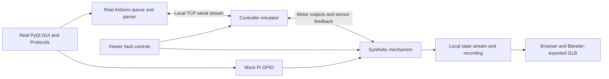

# KneeSpa desktop simulator

Run the real KneeSpa GUI beside a lightweight browser view of the Blender model.
The GUI uses its normal login, Setup controls, treatment workers, serial queue,
reply parser, readiness checks, and fault handling. A local service emulates the
controller and supplies simulated position/load feedback to both windows.

## Start testing

From the repository root on Windows:

```powershell
.\.venv\Scripts\python.exe development/tools/run_simulator.py
```

Or double-click `development/tools/launch_simulator.cmd`. The launcher opens the
GUI and browser together. This workspace already has the dependencies, viewer
build, and exported model prepared.

1. Wait for **Device · Ready** after the normal reset/baseline sequence.
2. Log in with **1234** (demo administrator) or **5678** (demo operator).
3. Use **Setup** to move the device, or **Treatment** to run a protocol.
4. Watch physical movement/load in the viewer and reported feedback in its
   **Sensor feedback** section. The model follows simulated physical position,
   so a frozen encoder can disagree with the displayed mechanism.
5. Use the viewer's fault controls to exercise failure handling. After a latched
   fault, clear its cause and use **Reset and home device** in Setup.
6. Close the GUI to end the session. **Restart App** keeps the same backend,
   recording, and device profile and runs normal initialization again.

The current application reports serial loss as an advisory and ends its reader;
after the injected disconnect period expires, use the GUI's profile menu →
**Restart App** to reconnect. Closing or reloading only the viewer does not stop
the simulated controller or treatment.

The optional demo patient PIN **2468** supplies a synthetic treatment plan through
a local cloud adapter. **Add new patient** also supports a synthetic staff sign-in:
email **staff@example.test**, password **simulator**, then select **Simulator clinic**.
This account exists only in the local simulator; it is not a deployed cloud account.
Intake, profile edits, and explicit plan approval follow the same GUI flow as the
staff API. Added patients and their PINs last for the simulator session.

The demo PIN and staff flow use
a local cloud adapter. Support requests and treatment uploads are captured in the
session recording; **Fail local deliveries** tests failure behavior. The real
cloud outbox code still runs, with its network boundary redirected locally.

## Connect to the cloud dashboard

Register a separate simulated device under **Devices → Register Device** in your
dashboard. Suggested ID: `drx-desktop-sim-01`; name: **DRX Desktop Simulator**.
Copy `development/simulator/cloud.env.example` to
`devices/development/cloud-simulator/raspberry-pi/cloud.env` and enter the token
shown once by the dashboard. This ignored file must contain all three values;
the simulator never borrows inherited Pi credentials.

Double-click `development/tools/launch_cloud_simulator.cmd`, or run:

```powershell
.\.venv\Scripts\python.exe development/tools/run_simulator.py --cloud
```

For another dedicated profile, use `--cloud-env PATH/TO/cloud.env`. An incomplete
profile fails before opening the simulator. The window title identifies the
cloud device. Motor control, calibration and local operator accounts are still
simulated. Support requests remain captured locally.

1. Refresh **Devices** after startup; the registration should show **Online**
   (an estimate based on authenticated contact). A ping runs every 60 seconds
   while the GUI is open. Queue telemetry and version reporting are not yet
   implemented, so **Sync: Unavailable** does not mean connection failed.
2. Wait for device readiness, then log in with local operator PIN **1234** or **5678**.
3. Open **Treatment**, choose its patient PIN action, and enter the PIN of a
   dedicated test patient created in the dashboard. The local demo PIN **2468**
   is not seeded in the real cloud.
4. Review the returned plan and run a simulated session. On completion or Stop,
   look for **Treatments synced** and refresh the test patient's dashboard history.

This mode performs real HTTPS patient lookups and uploads via the production
client. Use synthetic test patients for simulated sessions. The viewer's
**Fail local deliveries** switch affects the local demo/support adapter only;
it does not interrupt real cloud calls. Automated `--verify` scripts run only in
local mode to keep their synthetic fixtures out of the dashboard.

Cloud uploads persist beside the selected `cloud.env`, under
`data/<cloud-and-device-key>/pending_uploads.json`, across fresh simulator runs.
Different cloud/device identities use different queues; token rotation for the
same identity preserves the queue. Keep this profile when clearing `.cache`.
Cloud credentials and patient API bodies are not sent to the viewer recording.
Each run still has independent synthetic hardware state under `.cache/simulator`.

## Install on another development PC

Tested with Windows, Python 3.12, Node.js 24, and Blender 4.5 LTS. Blender is needed
only for model editing/export, not everyday testing.

```powershell
python -m venv .venv
.\.venv\Scripts\python.exe -m pip install -r development/simulator/requirements.txt
cd development/simulator/viewer
npm ci
npm run build
cd ../../..
.\.venv\Scripts\python.exe development/tools/run_simulator.py
```

The viewer's lockfile and `.npmrc` make the dependency resolution repeatable.
The service serves the built viewer itself; a Vite development server is optional.
If npm is unavailable in this prepared workspace, its local CLI can be invoked
as `node .cache/npm/package/bin/npm-cli.js` from the repository root.

### Video playback

The simulator uses the real VLC player for all nine bundled videos (the original
three clips plus the six Blahnik videos). **Video** opens the full list. Select
any title to start there and automatically play the following clips in list
order. **All videos** stops playback and returns to the list; finishing the last
clip or reopening the modal also shows the list. Previous/next, pause/resume,
volume, and fullscreen remain available during playback.

The Python binding is included in the simulator requirements; install
[VLC 3](https://www.videolan.org/vlc/) with the same architecture as Python
(64-bit in this workspace) for its native decoder and audio output.

Alternatively, extract the official
[VLC 3.0.23 Windows 64-bit ZIP](https://download.videolan.org/pub/videolan/vlc/3.0.23/win64/)
under `.cache/vlc/`, so `.cache/vlc/vlc-3.0.23/libvlc.dll` and its `plugins/`
directory exist. The simulator detects this portable copy automatically.
Explicit `PYTHON_VLC_LIB_PATH` and `PYTHON_VLC_MODULE_PATH` settings take
precedence. Nothing is downloaded by the launcher. Restart an already-open
simulator after installing playback dependencies or updating the launcher.

Without a working VLC runtime or clips, the video modal shows an unavailable
message and stays stopped. Audio preferences stay in the simulator session's
device profile. To verify list selection, actual decoded video/audio,
pause/resume, automatic clip transitions, fullscreen and close/reopen, run:

```powershell
.\.venv\Scripts\python.exe development/tools/run_simulator.py --no-browser --verify video
```

The session directory contains `verification.json`, decoded frame snapshots,
and GUI captures (Qt captures exclude the native video surface, so its frames
are saved separately). The usual pytest video tests use mocks; this verification
requires real VLC and checks advancing playback and rendered media instead.

Useful launcher options:

| Option | Behavior |
| --- | --- |
| `--no-browser` | Run the GUI/backend and print the session location without opening another browser. |
| `--backend-only` | Run only the local service for transport/viewer tests. |
| `--seed 8` | Select reproducible sensor noise. |
| `--duration 60` | End a verification GUI after 60 seconds, using its normal cleanup. |
| `--capture .cache/gui.png` | Save the actual GUI periodically for visual checks. |
| `--verify smoke` | Operate real widgets through login, three axes, FIT, and reset. |
| `--verify video` | Select from the library, play all nine real clips, and check automatic transitions and transport controls. |
| `--verify protocols` | Complete all four protocols at the real five-minute minimum; about 22 minutes. |
| `--verify faults` | Test failed preparation, jam/frozen feedback, pressure faults, physical stop, disconnect, and restart. |
| `--verify live` | Test pause/resume, pressure/angle/pulse edits, and GUI Stop/recovery. |
| `--verify restart` | Check restart preserves the same simulation session. |
| `--verify ux` | Script patient link/change/cancel, four review dialogs, Stop/outbox retry, Help/Support, and service access; capture both GUI resolutions. |
| `--verify ux-stops` | Exercise Stop during preparation/reset, pressure-notice Dismiss/Stop, banner Stop, and leg Stop. |
| `--verify protocol-1` through `protocol-4` | Complete one selected protocol at the normal five-minute minimum in an isolated session. |

Run GUI verification with the normal Windows Qt platform. The `offscreen` Qt
plugin hung while showing dialogs in this environment; the normal windows work.
The verifier clicks real widgets and checks controller/physical state. It does
not replace authentication, readiness, treatment durations, or treatment workers.
The UX scripts are automated operator scenarios, not human usability participants.
Their screenshots and timings do not measure glove accuracy, readability at working
distance, task comprehension, or a physical machine's stop latency.

## Blender workflow

Open `development/simulator/blender/drx.blend` in Blender. It contains an editable
**DRX working model** collection and a hidden **Reference - original GLB**
collection. The Text Editor's **READ ME - simulation rig** documents the contract.

Keep this hierarchy and the joint names:

```text
static_frame
  horizontal_pivot
    lateral_pivot
      axial_slider
```

Geometry is in meters. `drxAxisLocal` values describe the exported glTF Y-up frame,
while Blender uses Z-up. Patient left is negative; patient right is positive.
The original viewer's axial alignment correction is baked into the Blender source.
The browser does not apply that correction a second time.

After saving model edits, export and validate:

```powershell
blender --background --factory-startup --python-exit-code 1 --python development/simulator/blender/export_model.py
blender --background --factory-startup --python-exit-code 1 --python development/simulator/blender/validate_rig.py
cd development/simulator/viewer
npm test
npm run build
```

In this prepared workspace, the verified portable Blender executable is
`.cache/blender-runtime/blender-4.5.7-windows-x64/blender.exe`. Set
`BLENDER_USER_RESOURCES` to `.cache/blender-runtime/user` when using it in a
restricted environment. Do not rerun `build_model.py` after hand-editing the
model: that script creates the initial source again from `source.glb`.

Export produces `drx.glb` and `rig.json`. Validation produces
`reference-poses.json`: ten independent Blender poses, with landmarks on the
visible meshes as well as pivots. Three.js tests compare the exported asset,
including joint signs, combined rotations, a fixed chair, 4 inches / 0.1016 m of
axial travel, and 6 inches / 0.1524 m of FIT travel. Repeated poses must not drift.
The black box sits centered inside the gray traction cage and is parented to
`axial_slider`, so it follows axial travel and the inherited lateral/horizontal motion.
These are coordinate/parenting checks; the original dimensions and pivots have
not been measured against a physical device.

For browser regression checks, play a `--verify smoke` session recording at 1×
and evaluate `viewer/tests/observe-rendered-motion.js` just before pressing Play.
After playback, evaluate `window.drxRenderProbe.finish()`. This checks vertices
in the actual rendered scene: the camera and chair must stay fixed while the
front support, tray, traction carriage, and its black box move, including the fast FIT stroke.

## Faults and recordings

The fault panel supports jams, frozen encoders, a stale load cell, pressure bias,
failed tare, wrong firmware identity, delayed replies, corrupted status checksums,
dropped status, missing/wrong-sequence completion, fragmented replies, serial
disconnect, and a physical stop input independent of the GUI connection.
The `ux-stops` script also requests a `pressure_notice` wire fixture through the
local fault API. It sends the firmware's pressure-progress notice through the real
serial parser, with fixed travel/rise fixture values; it does not claim that the
unmeasured synthetic plant generated those travel/rise values.

The physical stop performs bounded load release. Serial `X` stops motion and
holds position; the GUI's Stop/Reset sequence subsequently requests release and
homing. Advisory warnings remain advisory. The simulator is useful specifically
because it lets the real application decide what those events mean.

Every run writes only under `.cache/simulator/<session>/`:

- `session.json`: local endpoints/token, seed, complete synthetic profile, and
  application/controller/profile/model fingerprints. Keep its token local.
- `session.jsonl`: commands, replies, physical/sensor states, GPIO outputs,
  faults, GUI observations, and captured external actions.
- `device/raspberry-pi/`: isolated configuration, demo accounts, logs, and outbox.
- `verification.json` and screenshots when a verifier is requested.

Use **Save session** / **Open recording** in the viewer to inspect past movement.
Playback can pause, scrub, or change speed; its fault controls are disabled.
Recorded timestamps drive playback. The viewer rejects stale/cross-session
snapshots, malformed poses, and incompatible model hashes.

The independent core replay checker reruns recorded commands/GPIO/fault inputs
using the original seed and compares every physical/sensor snapshot:

```powershell
.\.venv\Scripts\python.exe development/tools/check_simulator_replay.py .cache/simulator/SESSION/session.jsonl
```

It requires the matching controller source fingerprint. Retain that source
revision with recordings when changing the simulator implementation.

## Architecture and scope



The main production change is an optional serial factory/port in `Arduino`;
default hardware behavior is unchanged. The historical PTY test double shares
its serial vocabulary through `controller/serial_model.py`. All mock selection,
GPIO/cloud adapters, profiles, viewer assets, and session handling stay in
`development/`; routine Pi sync still transfers only `runtime/`.

This version uses a **Python firmware emulator and an unmeasured synthetic
mechanism**. It validates software sequencing, feedback handling, GUI behavior,
and repeatable fault/recovery workflows. It does not validate real force accuracy,
patient biomechanics, mechanical clearances, electrical wiring, or AVR timing.

The FIT fixture assumes one motor permitted by both the firmware timer and Pi
direction/enable outputs. Its assumed speed is 0.5 in/s and travel is bounded to
0–6 inches. FIT slides the entire front leg-support assembly away from the fixed
chair; axial travel moves the traction carriage within that assembly. The assembly
relationship is confirmed by the device owner; dimensions and travel remain estimates.
Establish the actual wiring/linkage before treating it as a physical prediction.
Axial load uses a simple slack-plus-spring fixture; use measured profiles later.

Connecting the native-compiled sketch to a dynamic plant and calibrating against
device measurements remain the separate follow-on milestone in the implementation
plan. Existing native firmware tests still exercise the actual sketch independently.

## Validation commands

```powershell
.\.venv\Scripts\python.exe -m pytest development/tests/unit -q --basetemp=.cache/simulator-unit-check
.\.venv\Scripts\python.exe development/tools/run_simulator.py --no-browser --verify smoke
.\.venv\Scripts\python.exe development/tools/run_simulator.py --no-browser --verify faults
.\.venv\Scripts\python.exe development/tools/run_simulator.py --no-browser --verify live
.\.venv\Scripts\python.exe development/tools/run_simulator.py --no-browser --verify protocols
```

Under Linux/WSL, retain the existing PTY and actual firmware checks:

```bash
python3 -m pytest development/tests/unit/test_fake_arduino.py development/tests/integration/test_arduino_comm.py -q
BUILD_DIR="$PWD/.cache/simulator-native-tests" bash development/tests/firmware/run_native_tests.sh
```

See `development/docs/plans/2026-09-21-blender-simulator-testing-plan.md` for the
design rationale, acceptance scenarios, and later measurement/native-backend work.
